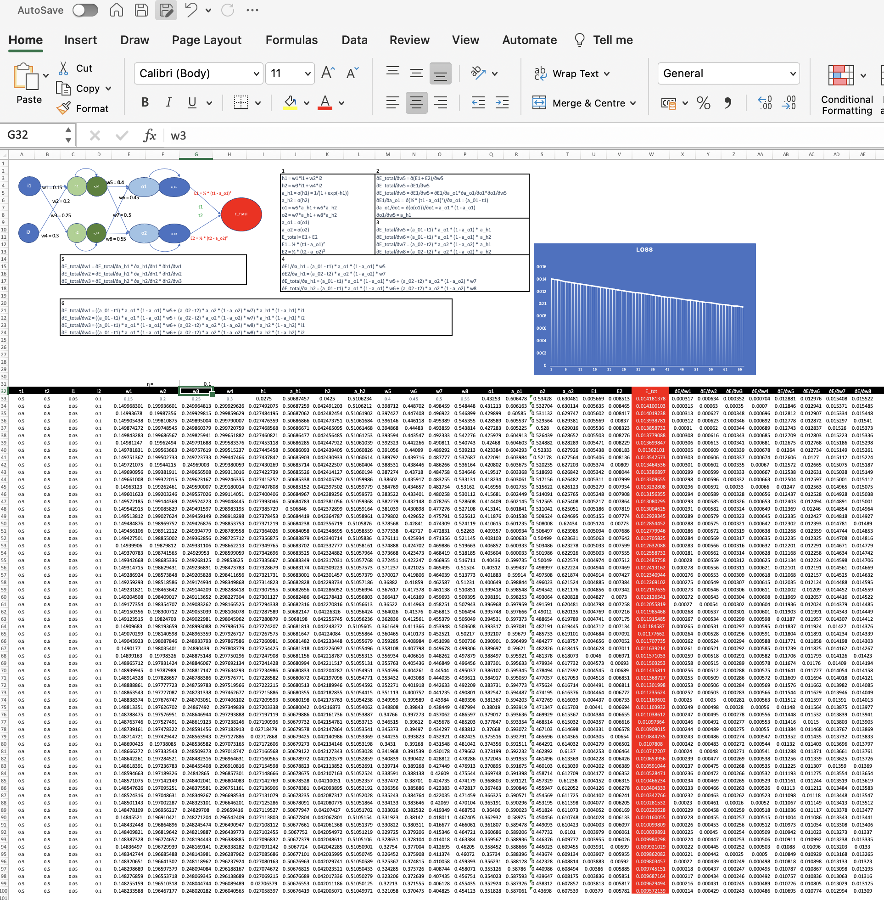
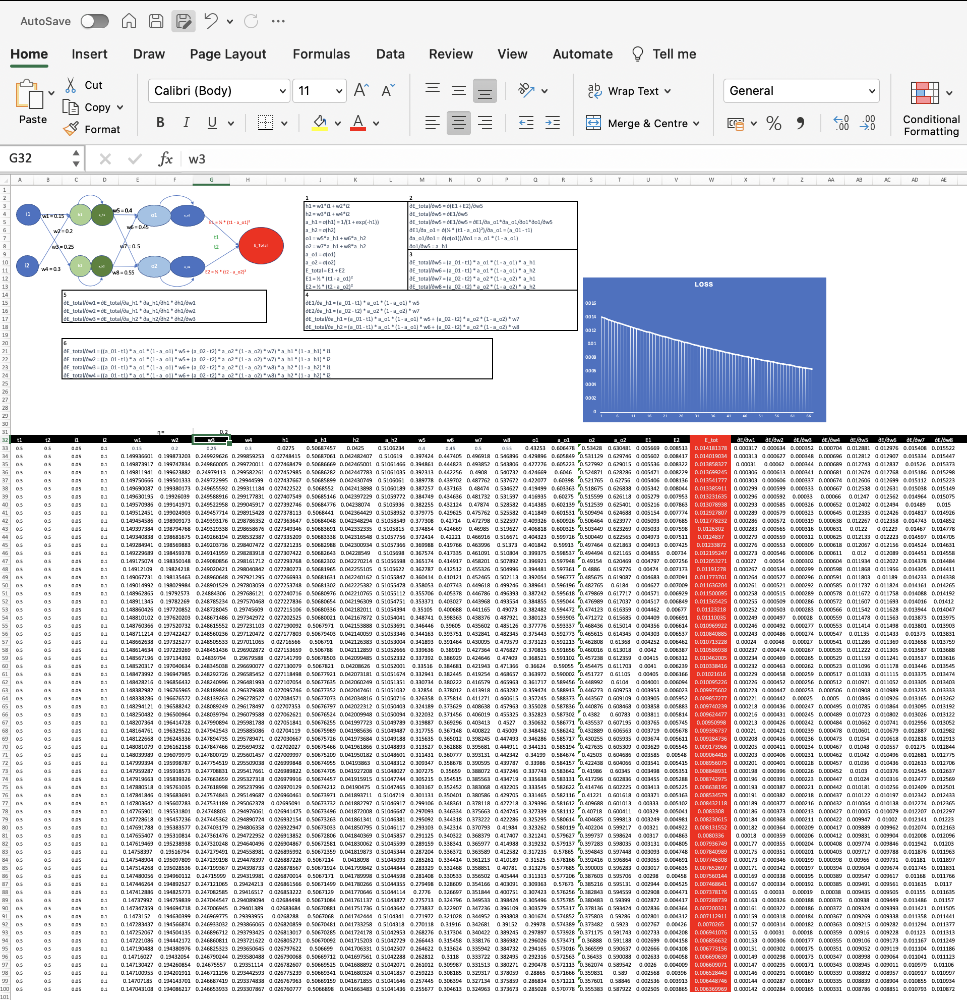
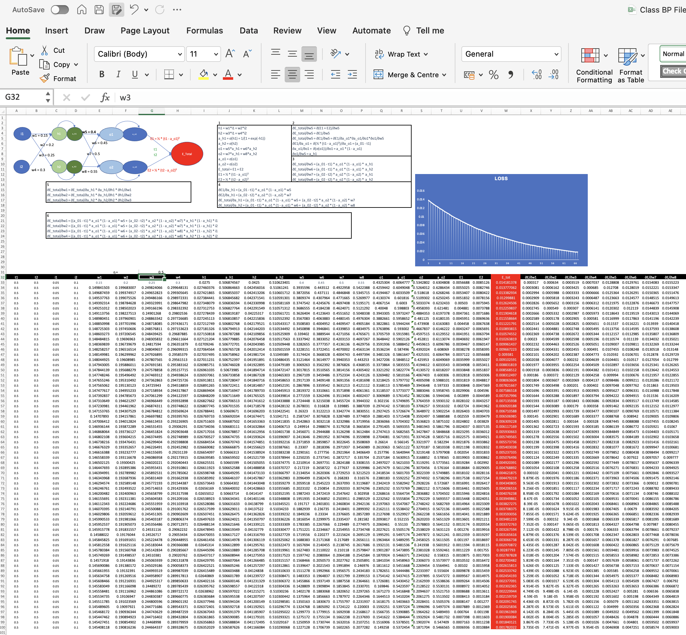
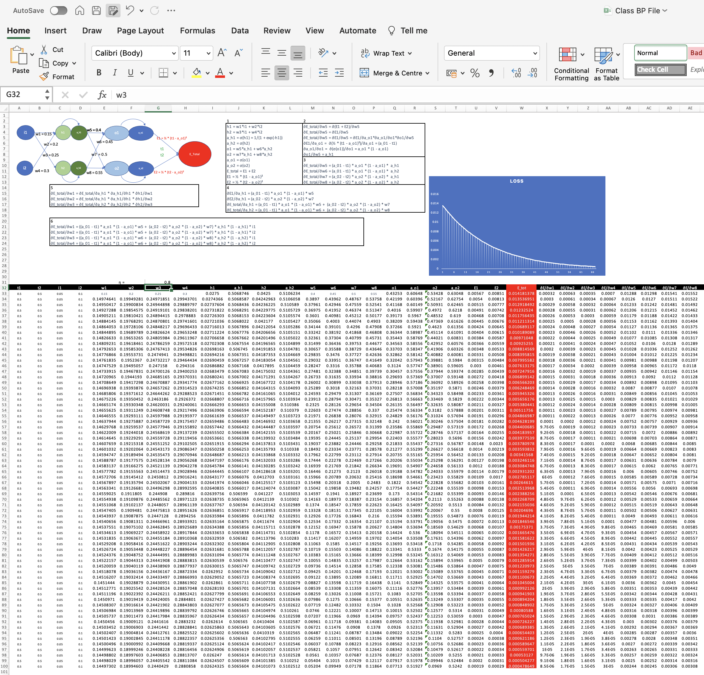
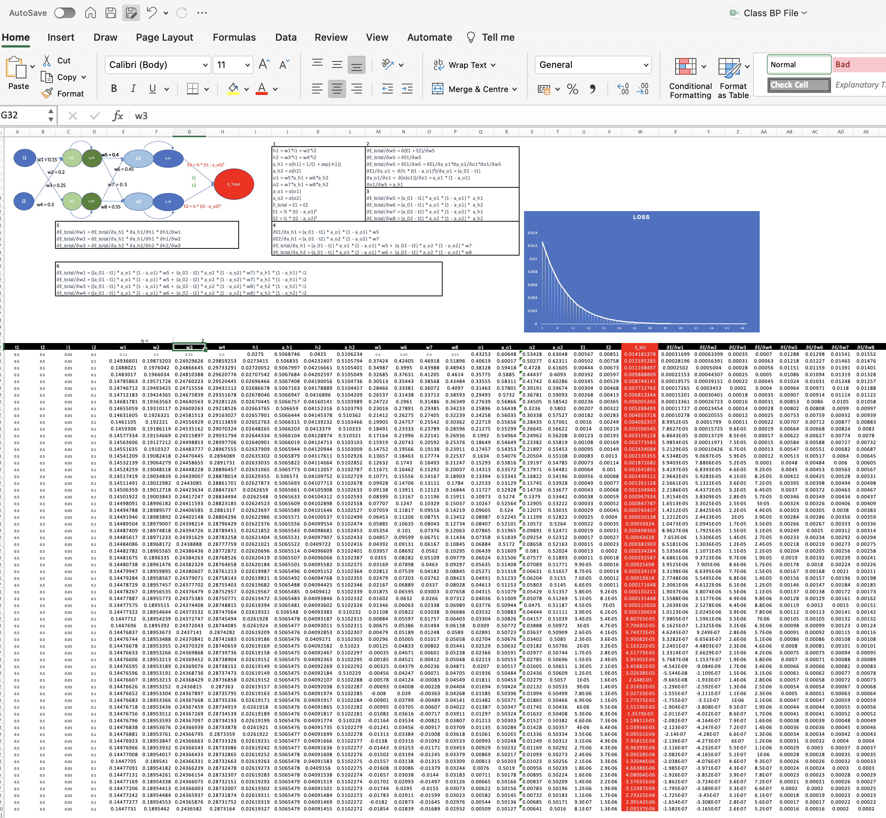

# This document shows main steps of backup propagation

## Neural network description and values used to demonstrate backup propagation

### This neural network has 2 inputs(i1 and i2) and 2 outputs(a_o1, a_o2) target outputs to predict is 0.5 with an objective to minimize total error at various learning rates

### it has 2 layers({h1, ah1 h2, ah2}, {o1, oh1 o2, oh2}), each layer has neuron with sigma activation weights/learning coming from both the neurons or input

### output of each neuron go to next layer neuron and never cross connect

### 0.05 and 0.1 are inputs, initial weights we start with w1,w2,w3 and w4 as 0.1,0.15,0.2,0.25 and

### w5,w6,w7 and w8 as 0.4, 0.45, 0.5 and 0.55

## Process of back propagation

### step 1:

### compute neural network output(h1,h2,o1,o2), activated output(sigma)(a_h1,a_h2,a_o1,a_o2) based on initial weights(w1 to w8) and input(i1 and i2) in each layer

### Compute the partial derivative of error wrt its previous layer weights based on chain rule

### Finally compute partial derivative of error wrt initial weights w1 to w8 based on chain rule

### step2

### modify weights by initial weight - learning rate\* error/dweight

### step3

### plot the loss graph Error as we repeate the steps for a given learning rate

### overall back propagation results with learning rate 1

### overall back propagation results with learning rate 0.1

### overall back propagation results with learning rate 0.2

### overall back propagation results with learning rate 0.5

### overall back propagation results with learning rate 0.8

### overall back propagation results with learning rate 1.0

### overall back propagation results with learning rate 2.0

